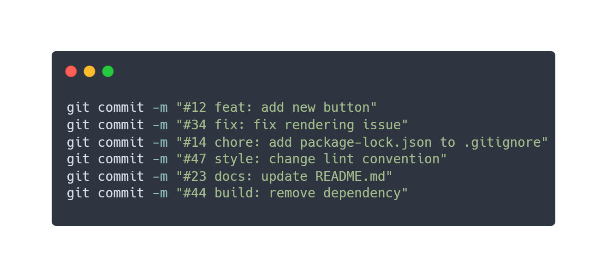

<h1>
  
</h1>

<p>EnergyView is a research and development initiative in the burgeoning field of Digital Twins, designed to revolutionize the way we monitor and comprehend real-time energy consumption. With a distributed and intelligent approach, EnergyView provides a comprehensive and detailed view of energy consumption within an environment, enabling precise analysis and informed decision-making.</p>

<p>This project is a product of GARSoft's ownership, do not copy or redistribute this code without granted permission.</p>

## How to run

Note that this code requires Angular and Node.js to work.

1. Clone the repository on a local directory;
2. Inside the repository's directory open a terminal;
3. Run `npm install` to install dependencies;
4. Run `npm run dev` to serve the app in the development environment or `npm run prod` for the production environment;
5. After compiling the app should be served on [http://localhost:4200/](http://localhost:4200/),

## Testing, linting and commit hooks

When commiting, your code will be checked and should:
1. Pass all unit tests (and those should have minimum code coverage).
2. Pass all linters.

You can run the pre-commit checks on-demand running the following commands:
* To execute the pre-commit checks run `npm run pre-commit`.
  * To execute unit tests run `npm run test`.
  * To execute the linters run `npm run lint`, to execute and solve auto-fixable errors and warnings run `npm run lint-fix`.
    * To execute the TypeScript linter run `npm run lint:ts`, to execute and solve auto-fixable errors and warnings  run `npm run lint:ts-fix`.
    * To execute the SCSS linter run `npm run lint:scss`, to execute and solve auto-fixable errors and warnings  run `npm run lint:scss-fix`.
    * To execute the HTML linter run `npm run lint:html`.

## Workflow

### Issue creation

Prior to initiating any development endeavors, it is imperative to create an issue that succinctly delineates the task at hand. Utilize this issue as a platform for comprehensive discussion and planning of the intended feature or fix.

### Branch naming and commit pattern

When developing, your work branch should be named following the naming pattern:

* **features**: YYYYMMDD/feat/name-of-feature
* **fixes**: YYYYMMDD/fix/name-of-fix
* **refactoring**: YYYYMMDD/refactor/name-of-refactor

Please ensure that you replace YYYYMMDD with the current date, formatted as Year-Month-Day.

#### Adapted conventional commits pattern

When commiting, always make use of our modified conventional commit pattern to ensure the maintenance of a consistent and informative commit history. Each commit message must conform to the prescribed format, as outlined below:

```
#N type: message
```

Where:

* **N**: Is the number of the aforementioned created issue.
* **type**: Describes the purpose of the commit (e.g., feat, fix, chore, docs, style, refactor, test).
* **message**: Is a brief, descriptive message of the change, in the imperative form.

For example:

```
#123 feat: add new button
```
<p align="center">
  
</p>

The types are as follows:


* **test**: Indicates any type of creation or modification of test code. Example: Creation of unit tests.
* **feat**: Indicates the development of a new feature in the project. Example: Adding a service, functionality, endpoint, etc.
* **refactor**: Used when there is a code refactoring that has no impact on the system's logic/business rules. Example: Code changes after a code review.
* **style**: Employed when there are changes in code formatting and style that do not alter the system in any way. Example: Changing the style guide, switching lint conventions, fixing indentations, removing whitespace, removing comments, etc.
* **fix**: Used when there is a correction of errors that are causing bugs in the system. Example: Applying handling for a function that is not behaving as expected and returning an error.
* **chore**: Indicates changes in the project that do not affect the system or test files. These are development changes. Example: Changing ESLint rules, adding Prettier, adding more file extensions to .gitignore.
* **docs**: Used when there are changes in the project's documentation. Example: Adding information to the API documentation, changing the README, etc.
* **build**: Used to indicate changes that affect the project's build process or external dependencies. Example: Gulp, adding/removing npm dependencies, etc.
* **perf**: Indicates a change that improved the system's performance. Example: Changing forEach to while, improving a database query, etc.
* **ci**: Used for changes in CI (Continuous Integration) configuration files. Example: Circle, Travis, BrowserStack, etc.
* **revert**: Indicates the reversal of a previous commit.

### Pull Request (PR)

When you are ready to merge your changes, initiate a Pull Request (PR) from your feature/fix branch to the relevant target branch (e.g., main).

In the PR's description, concisely outline the nature of the changes and make reference to the associated issue through the following format:

```
Closes #N

Description
```

Replace N with the number of the issue you created earlier.

For example:

```
Closes #123

Adds new button to the daily consumption dashboard page.
```

Someone else should review and approve the code. After approval, you can merge the request and delete the work branch.

### Example workflow

1. Create an issue on the repository's issue tracker, describing the task.
2. Create a branch for your work following the naming pattern.
3. Make your changes in the branch, following the conventional commit format for your commits.
4. When you are ready to merge your changes, create a PR from your branch to the appropriate target branch (e.g., main).
4. In the PR description, add "Closes #N" to link the PR to the issue and summarize your changes. Replace N with the issue number.
5. Review and discuss the changes in the PR.
6. Once the PR is approved, merge it into the target branch.
